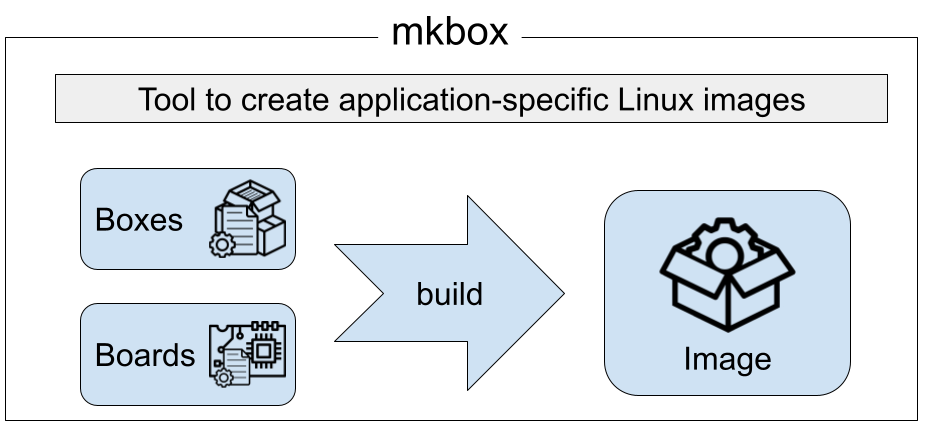

# mkbox

This project provides an easy way to automatically create an application-specific Linux image for an IoT device.

## Install

There are two possibilities to install the mkbox-project:

__Clone the git repository and build the Linux kernel__

```bash
# git clone 
git clone https://github.com/TCI-LUH/mkbox-project.git

# build all board dependencies
for build in boards/*/build.sh; do "$build"; done
```

__Download and extract a prebuild__

Downloads are available under [https://github.com/TCI-LUH/mkbox-project/releases](https://github.com/TCI-LUH/mkbox-project/releases)

```bash
# unpack the package
tar –xvzf mkbox-project*.tar.gz
```

## Usage
 
```bash
sudo -E BOARD="<board name>" mkbox "<BOXBUILD file>"
```

This command creates an image file in the current working directory: `<name>-<BOARD>[-<BOX_BRANCH>][-<BOX_VERSION>].img`.

### Important Environment options

- BOARD: name of the single-board-computer (required)
- BOXES_BASE: search path for the boxes (optional, default: `<mkbox root path>/../boxes`)
- BOARDS_BASE: search path for the boards (optional, default: `<mkbox root path>/../boards`)
- BOX_BRANCH: the branch name of this box build (optional, default unset)
- BOX_VERSION: the version of this box build (optional, default unset)

## Example

A simple example can be found at [src/examples/led-blink/README.md](src/examples/led-blink/README.md).
It showcases the software's basics by using a flashing LED with GPIO and an Odroid-C4.


## Concept

This project is separated into three layers (Fig 1) __mkbox__, __boxes__ and __boards__.

<p align="center">
    
    <br>Fig 1: mkbox software architecture
</p>

### mkbox

The first layer __mkbox__ is for the administrative user, who wants to build and deploy a linux-box. This layer contains the tool __mkbox__ for the build tasks and the __update-server__ to deploy the ready images to the devices.

### Boxes
Application-specific, small resource-saving images, specialized for one task. Each built box is a Linux system that can be booted on a SBC and can extend another box as a base, to define more complex boxes. Each box consists of a BOXBUILD file describing the box details (name, contents, Linux packages and system configurations).


### Boards

Single board computers (SBCs) on which the Linux boxes are to run. The mkbox project provides various configurations for different SBCs, which are similar to the boxes. Each board consists of a BOXBUILD file describing which components the SBC needs to boot.

### Build
The core functionality of the mkbox project is the build process that creates the individual Linux boxes. By separating the boxes from the hardware layer, it is easily possible to build different boxes for different SBCs by swapping the boards internally in the build process.

### Image
Contains the final result of the build process as a compressed file, ready to be deployed manually or to an update server.


### Dependencies

The following commands are used by the mkbox tool:

- bash
- cat
- chmod
- chown
- chroot
- cp
- cpio
- dd
- df
- dirname
- envsubst
- find
- grep
- gzip
- ln
- losetup
- mkdir
- mkfs.ext4
- mkfs.fat
- mkimage
- mktemp
- mount
- numfmt
- openssl
- readlink
- realpath
- rm
- sed
- sfdisk
- su
- sync
- truncate
- useradd
- which

They can be found in the following Arch-Linux packages:

- bash
- coreutils
- cpio
- dosfstools
- e2fsprogs
- findutils
- gettext
- grep
- gzip
- openssl
- sed
- shadow
- uboot-tools
- util-linux
- which

## Documentation

For further information see the man pages:

- [src/mkbox/man/mkbox.1.md](src/mkbox/man/mkbox.1.md)
- [src/mkbox/man/mkbox-update-server.1.md](src/mkbox/man/mkbox-update-server.1.md)
- [src/mkbox/man/BOXBUILD.8.md](src/mkbox/man/BOXBUILD.8.md)
