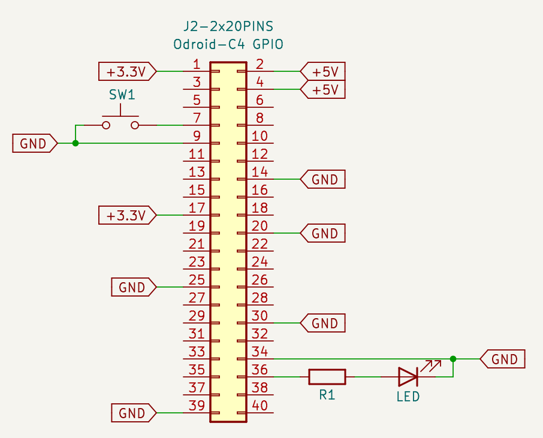

# LED-blink on Odroid-C4

The purpose of this example is to create a Linux image containing a LED blinking script and an optional user interaction button.
This example or a different Linux box can serve as a starting point for other boxes.

## Requirements

This box is designed to be used with an Odroid-C4 and requires an LED with a series resistor. It can also use a push button, but this is optional. The necessary wiring is shown in the schematic in Fig 1.

<p align="center">
    
    <br>Fig 1: Schematic of the blink example, to connect the LED, Resistor and Push Button/
</p>

## Building the Linux kernel

To prepare the use of the Odroid-C4 board in a box, it is necessary to build the Linux kernel.
Therefore, execute the build script located in the Odroid-C4 folder.

```bash
./boards/odroid-c4/build.sh
```

After the successful build process, this board is ready to be used for creating Linux images.

One alternative is to use a pre-built environment.

## Create the Image

To create the Linux image for this example, execute the following command in the directory `examples/led-blink`.

```bash
BOARD=odroid-c4 sudo -E ../../mkbox/mkbox BOXBUILD
```

After creating the image, you can flush this image to an SD card or eMMC chip and insert it into the SCB by running the following command, where /dev/sdX is your storage device for the SBC.

```bash
dd if='example-led-blink-odroid-c4.img' of='/dev/sdX' bs=16k status=progress && sync
```


## Content of this Example

### BOXBUILD

The configurations and files used for the image are described in the `BOXBUILD` file.
This will include `ssh` for connectivity, `python` for scripting, and some dependencies to use the gpio pins.

### Python script

The main component of this example is the Python script located at `root/blink.py`. It contains the logic to drive the LED to blink and includes optional checks to increase the blink frequency temporarily if the button is pressed.

### Service file

The `root/etc/init.d/example` service file automatically starts the Python script `root/blink.py` after the boot process. 

## Automaticly image creation

The process of creating an image can be automated through a GitLab pipeline, such as the one defined in `example.gitlab-ci.yml`.
This pipeline consists of two stages: a deploy step to copy the necessary content of the box to a workspace where `mkbox` can be executed and find the new version of the box.
The second step is to create an image for each known board by executing the `mkbox` tool as described above and copying the resulting image to a location that is accessible for download or for the update server. Please refer to the man page for more information about the update-server. [mkbox/man/mkbox-update-server.1.md](../../mkbox/man/mkbox-update-server.1.md).